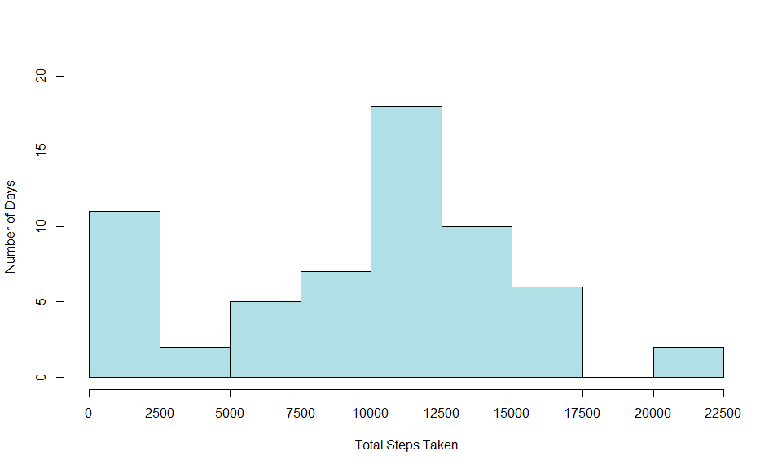
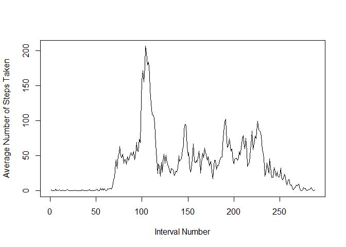
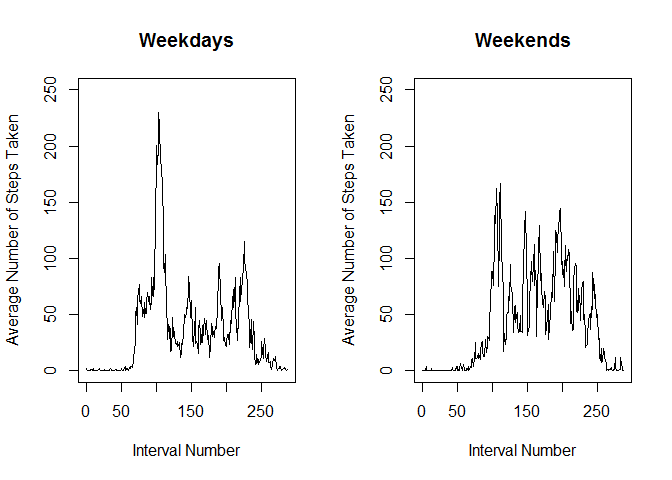

### Part 1
**1. Load the data (i.e. read.csv())**


```r
zipfile_url <- 'https://d396qusza40orc.cloudfront.net/repdata%2Fdata%2Factivity.zip'
download.file(zipfile_url, destfile = ".\\zip_file.zip")
unzip('zip_file.zip')
file_name <- 'activity.csv'
mon_data <- read.csv(file_name)
```
**The data consists of two months of data from an anonymous individual collected during the months of October and November, 2012 and include the number of steps taken in 5 minute intervals each day.
The variables included in this dataset are:**  
**- steps: Number of steps taking in a 5-minute interval (missing values are coded as NA)**   
**- date: The date on which the measurement was taken in YYYY-MM-DD format**  
**- interval: Identifier for the 5-minute interval in which measurement was taken**  
**The dataset is stored in a comma-separated-value (CSV) file and there are a total of 17,568 observations in this dataset.**

**2. Process/transform the data (if necessary) into a format suitable for your analysis.**  
Create new column with date as a Date object. 

```r
mon_data$date_d <- as.Date(as.character(mon_data$date))
```


### Part 2
**What is mean total number of steps taken per day?**  
**For this part of the assignment, you can ignore the missing values in the dataset.**

**1. Calculate the total number of steps taken per day**

```r
steps_byDay_data <- with(mon_data, tapply(steps, date, sum, na.rm = T)) 
```
Check that there are 61 rows (days).

```r
nrow(steps_byDay_data) 
```

```
## [1] 61
```

**2. Make a histogram of the total number of steps taken each day.**

```r
hist(steps_byDay_data, breaks=seq(0,22500, 2500), xaxt = 'n', xlab = "Total Steps Taken", 
     ylab = "Number of Days", ylim = range(seq(0,20, 5)), main = '', col = 'powderblue')
axis(side=1, at=seq(0,22500, 2500), labels=seq(0,22500, 2500))
```

<!-- -->

**3. Calculate and report the mean and median of the total number of steps taken per day.**

```r
mean_steps <- round(mean(steps_byDay_data), digits = 3)
median_steps <- round(median(steps_byDay_data), digits = 3)
mean_steps
```

```
## [1] 9354.23
```

```r
median_steps
```

```
## [1] 10395
```
The mean total number of steps per day is 9354.23. The median total number of steps per day is 10395.

### Part 3 
**What is the average daily activity pattern?**  
**1. Make a time series plot (i.e. type = "l") of the 5-minute interval (x-axis) and the average number of steps taken, averaged across all days (y-axis).**

```r
steps_byInt_data <- with(mon_data, tapply(steps, interval, mean, na.rm = T)) 
```

Check that there are 288 rows (1440 minutes in a day, split into 5 minute intervals).

```r
nrow(steps_byInt_data) 
```

```
## [1] 288
```

Create plot.

```r
plot(steps_byInt_data, type = 'l', xlab = 'Interval Number', ylab = 'Average Number of Steps Taken')
```

<!-- -->

**2. Which 5-minute interval, on average across all the days in the dataset, contains the maximum number of steps?**

```r
max_int <- match(max(steps_byInt_data), steps_byInt_data)
max_int
```

```
## [1] 104
```
The interval with the maximum number of steps, on average, is interval 104, which corresponds to minute 835.

### Part 4 
**Note that there are a number of days/intervals where there are missing values (NA). The presence of missing days may introduce bias into some calculations or summaries of the data.**

**1. Calculate and report the total number of missing values in the dataset (i.e. the total number of rows with NAs).**

```r
missing <- sum(is.na(mon_data$steps))
missing
```

```
## [1] 2304
```
The total number of missing values is 2304.

**2. Devise a strategy for filling in all of the missing values in the dataset.**  
The strategy chosen is to use the mean for the 5-minute interval to impute missing data.

**3. Create a new dataset that is equal to the original dataset but with the missing data filled in.**

```r
mon_data_filled <- mon_data
for(i in 1:nrow(mon_data_filled)){
    if(is.na(mon_data_filled$steps[i])){
        int <- as.character(mon_data_filled$interval[i])
        num <- steps_byInt_data[[int]]
        mon_data_filled$steps[i] <- num
    }
}
```

**4. Make a histogram of the total number of steps taken each day.**

```r
steps_byDay_data2 <- with(mon_data_filled, tapply(steps, date, sum)) 
```

Check that there are 61 rows (days).

```r
nrow(steps_byDay_data2) 
```

```
## [1] 61
```

```r
hist(steps_byDay_data2, breaks=seq(0,22500, 2500), xaxt = 'n', xlab = "Total Steps Taken", 
     ylab = "Number of Days", ylim = range(seq(0, 30, 5)), main = '', col = 'powderblue')
axis(side=1, at=seq(0,22500, 2500), labels=seq(0,22500, 2500))
```

<!-- -->

**Calculate and report the mean and median total number of steps taken per day.** 

```r
mean_steps2 <- round(mean(steps_byDay_data2), digits = 3)
median_steps2 <- round(median(steps_byDay_data2), digits = 3)
mean_steps2
```

```
## [1] 10766.19
```

```r
median_steps2
```

```
## [1] 10766.19
```
The mean total number of steps per day is 10766.189. The median total number of steps per day is 10766.189.

**Do these values differ from the estimates from the first part of the assignment?**  
The mean number of steps per day with the imputed data is 1411.959 steps more than without the imputed data.  
The median number of steps per day with the with the imputed data is 371.189 steps more than without the imputed data.  

**What is the impact of imputing missing data on the estimates of the total daily number of steps?**  
The impact of imputing missing data is to increase the estimate of the total daily number of steps.

### Part 5
**Are there differences in activity patterns between weekdays and weekends?**  
**For this part the weekdays() function may be of some help here. Use the dataset with the filled-in missing values for this part.**  

**1. Create a new factor variable in the dataset with two levels - "weekday" and "weekend" indicating whether a given date is a weekday or weekend day.**


```r
weekend <- c('Saturday','Sunday')
mon_data_filled$day_type <- ''
for(i in 1:nrow(mon_data_filled)){
    day <- weekdays(mon_data_filled$date_d[i])
    if(day %in% weekend){
        mon_data_filled$day_type[i] <- 'weekend'
    } else {
        mon_data_filled$day_type[i] <- 'weekday'
    }
}
mon_data_filled$day_type <- as.factor(mon_data_filled$day_type) 
```
Check new variable and data.

```r
class(mon_data_filled$day_type)
```

```
## [1] "factor"
```

```r
str(mon_data_filled)
```

```
## 'data.frame':	17568 obs. of  5 variables:
##  $ steps   : num  1.717 0.3396 0.1321 0.1509 0.0755 ...
##  $ date    : Factor w/ 61 levels "2012-10-01","2012-10-02",..: 1 1 1 1 1 1 1 1 1 1 ...
##  $ interval: int  0 5 10 15 20 25 30 35 40 45 ...
##  $ date_d  : Date, format: "2012-10-01" "2012-10-01" ...
##  $ day_type: Factor w/ 2 levels "weekday","weekend": 1 1 1 1 1 1 1 1 1 1 ...
```

**2. Make a panel plot containing a time series plot (i.e. type="l") of the 5-minute interval (x-axis) and the average number of steps taken, averaged across all weekday days or weekend days (y-axis).**  

Subset data set into weekdays and weekends.

```r
weekday_data <- subset(mon_data_filled, mon_data_filled$day_type == 'weekday')
weekday_steps_data <- with(weekday_data, tapply(steps, c(interval), mean, na.rm = T)) 

weekend_data <- subset(mon_data_filled, mon_data_filled$day_type == 'weekend')
weekend_steps_data <- with(weekend_data, tapply(steps, c(interval), mean, na.rm = T)) 
```

Check data; nrows should be 288.

```r
head(weekday_steps_data)
```

```
##          0          5         10         15         20         25 
## 2.25115304 0.44528302 0.17316562 0.19790356 0.09895178 1.59035639
```

```r
head(weekend_steps_data)
```

```
##           0           5          10          15          20          25 
## 0.214622642 0.042452830 0.016509434 0.018867925 0.009433962 3.511792453
```

```r
nrow(weekday_steps_data)
```

```
## [1] 288
```

```r
nrow(weekend_steps_data)
```

```
## [1] 288
```

Create plot.

```r
par(mfrow=c(1,2))
plot(weekday_steps_data, type = 'l', xlab = 'Interval Number', ylab = 'Average Number of Steps Taken', 
     main = 'Weekdays', ylim = c(0,250))
plot(weekend_steps_data, type = 'l', xlab = 'Interval Number', ylab = 'Average Number of Steps Taken', 
     main = 'Weekends',ylim = c(0,250))
```

<!-- -->
